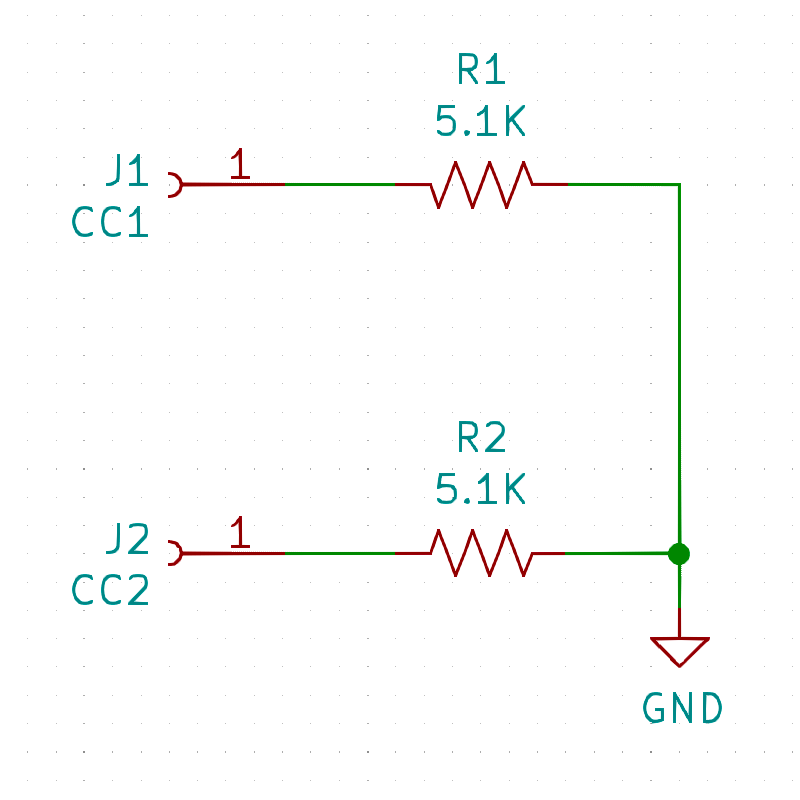
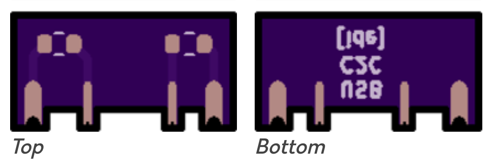

# USB-C-to-C Power Mod Flex PCB

Many devices have a USB-C connector to charge or power them. This is very convenient given the popularity of USB-C, its reversible cable design, and sturdy, compact design.

However, some devices will not draw power when using a USB-C-to-C cable connected to a spec-compliant charger, but will when using a USB-A-to-C cable. The USB-C specification requires upstream facing ports (UFPs), the port of the device receiving power, to connect pull-down resistors to the configuration channel (CC) pins. These missing pull-down resistors are a common reason why devices can draw power with A-to-C cables but not C-to-C ones.

Wouldn't it be great to be able to add these resistors and enable USB-C-to-C power? This mod does just that. It is a small flex PCB with pads for two 5.1kohm pull-down resistors between CC1 and CC2, respectively, and GND.

### Circuit

### PCB

## Supported devices

This PCB can fit into a wide variety of devices whose **USB-C connectors soldered onto 12 pads**. (Note: these connectors are sometimes described as having "16+8 dummy pins". Four of the VBUS pins are wired to two VBUS pads and four of the GND pins are wired to two GND pads, which is why the USB-C port has 16 active pins but only 12 solder pads.) The number of solder leads varies between USB-C connectors; be sure to inspect the main PCB of your device and ensure the USB-C connector has 12 soldered leads. If your device's USB-C connector has a different number of leads, this PCB will not work; however, the concept of connecting two 5.1kohm resistors between the CC pins and ground would work if you were to alter this mod.

Also, the device's PCB needs to have room behind the USB-C connectors to install the mod. The mod is very small but does require a few millimeters of clearance behind the USB-C connector.

## Flex PCBs

Flex PCBs are more expensive than rigid PCBs but are much thinner, making this mod less obtrusive and easier to retrofit into more devices. The PCB also needs to be thin in order to solder its castellations to the CC and GND pads of the main PCB.

## Required equipment and skills

### Parts

* 1x flex PCB
  * [OSH Park](https://oshpark.com/) is a great option worldwide
* 2x 5.1kohm ±10% or smaller 0402 resistors
  * Order extras as they are difficult to find if lost on the floor
  * [Panasonic ERJ-2GEJ512X](https://www.digikey.com/en/products/detail/ERJ-2GEJ512X/P5.1KJCT-ND/147043)

### Tools

* A fine-tipped soldering iron, solder, and flux
* Precision tweezers

### Skills

You will need to solder two SMD resistors to the flex PCB and the flex PCB to your device's main PCB. A steady hand is necessary and soldering experience is highly recommended. USB connectors are subject to stress and making the sub-millimeter solder joints strong will help keep your mod working for a long time.

## Help and support

You can use this mod however you'd like under the terms of the MIT License.

Speaking plainly, other forums or chats on the internet are better places to look for help than this repo.

You are responsible for any damage to your devices that might come from this mod or trying to install this mod.
